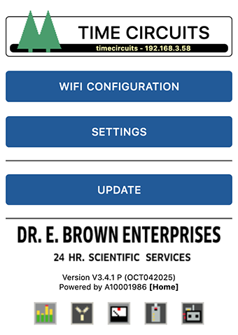
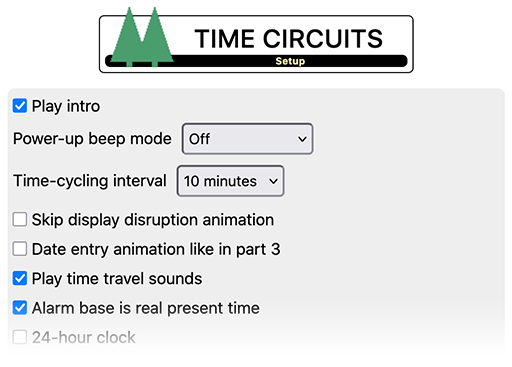
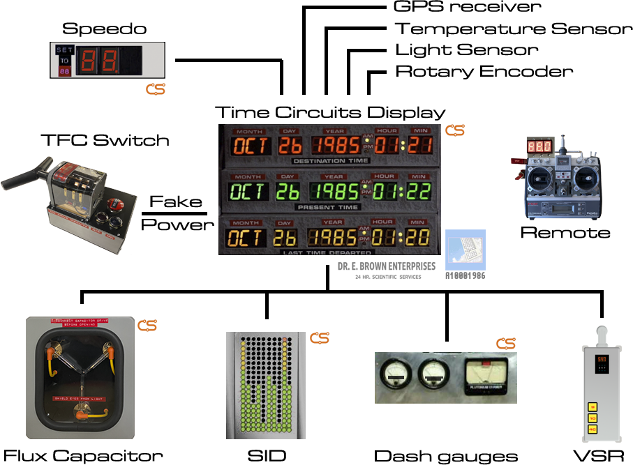
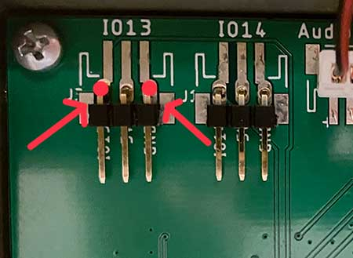

# Time Circuits Display

|  |
|:--:|
| *This very TCD is now used in the Universal Studios [BTTF Escape Room](https://www.universalorlando.com/web/en/us/things-to-do/entertainment/universals-great-movie-escape) (Orlando)* |

The CircuitSetup Time Circuits Display has been meticulously reproduced to be as accurate as possible to the one seen in the DeLorean Time Machine. The LED displays are custom made to the correct size for CircuitSetup. This includes the month 14 segment/3 character displays being closer together, and both the 7 & 14 segment displays being 0.6" high by 0.35" wide.

## TCD Kits
[Time Circuits Display kits can be purchased here with or without 3d printed parts or aluminum enclosures.](https://circuitsetup.us/product/complete-time-circuits-display-kit/)

[View the instructions for assembling your CircuitSetup.us TCD Kit](https://github.com/CircuitSetup/Time-Circuits-Display/wiki)

Features include

- Clock-related:
  - Time keeping for years 1-9999, accurately based on Julian and Gregorian [calendars](#calendar-system)
  - Support for time zones and automatic DST (Daylight Saving adjustment)
  - Time synchronization through Internet ([NTP](https://en.wikipedia.org/wiki/Network_Time_Protocol)) or [GPS](#gps-receiver)
  - [World Clock mode](#world-clock-mode): Show current time in different time zones in *destination time* and/or *last time departed* displays
  - [Alarm function](#how-to-set-up-the-alarm): Daily alarms, with weekday selection
  - [Count-down timer](#count-down-timer): Count down from up to 99 minutes
  - [Yearly/monthly reminder](#yearlymonthly-reminder): Get a yearly or monthly acoustic reminder
  - [Sound on the hour](#additional-custom-sounds)
- Movie-related:
  - Movie-accurate [Beep](#beep-on-the-second) sound every second (4 modes)
  - Movie-accurate [time travel](#time-travel) function
  - ["Return from Time Travel"](#time-travel): Return to real present time easily
  - ["Decorative mode"](#time-cycling): Movie-accurate time travel times displayed in *destination time* and *last time departed* displays, and cycled in configurable interval
  - [Exhibition mode](#exhibition-mode): Show a fixed time in *Present Time* display instead of a running clock. Helpful for filming or museums.
- Network capabilities:
  - Advanced network-accessible [Config Portal](#the-config-portal) for setup (http://timecircuits.local, hostname configurable)
  - [Wireless communication](#bttf-network-bttfn) with compatible other props such as CircuitSetup's [Flux Capacitor](https://fc.out-a-ti.me) and [SID](https://sid.out-a-ti.me), as well as the [Dash Gauges](https://dg.out-a-ti.me), [VSR](https://vsr.out-a-ti.me) and modified [Futaba Remote Control](https://remote.out-a-ti.me)
  - [Home Assistant](#home-assistant--mqtt) (MQTT 3.1.1) support
- [Night mode](#night-mode): Dim or switch off displays on schedule, manually or sensor-controlled.
- [Music player](#the-music-player): Play mp3 files located on an SD card
- Audio output through [line-out](#audio-output) for time travel sounds and music (requires Control Board 1.4.5 or later), allows connecting your TCD to your (car) stereo for high-quality stereo-sound.
- Support for [SD cards](#sd-card) up to 32GB
- [Keypad-controlled menu](#the-keypad-menu) for adjusting various settings and viewing status through the three displays
- Peripherals:
  - Support for [fake "power switch"](#fake-power-switch) (eg. a [TFC drive switch](https://tfc.out-a-ti.me))
  - Support for time travel [triggered by external source](#external-time-travel-trigger), with optional delay
  - Support for [speedometer](#speedometer) (eg. CircuitSetup's [speedo](https://circuitsetup.us/product/delorean-time-machine-speedometer-kit))
  - Support for [GPS receiver](#gps-receiver), used as time source and for actual [speed](#gps-for-speed) to be displayed on speedo
  - Support for [rotary encoders](#rotary-encoder) for manual selection of speed to be displayed on speedo, and/or audio volume
  - Support for [temperature/humidity sensor](#room-condition-mode-temperaturehumidity-sensor) for [Room Condition mode](#room-condition-mode-temperaturehumidity-sensor) [display temperature and humidity in *destination time* and *last time departed* displays] and for displaying temperature on speedo while idle
  - Support for [Futaba remote control prop](#futaba-remote-control): Remote control the speed on the speedo, like in the movie
  - Support for triggering time travels on other props [connected by wire](#connecting-props-by-wire)

|  |
|:--:|
| Click to watch the video |

## Firmware Installation

If a previous version of the TCD firmware is installed on your device, you can update easily using the pre-compiled binary. Enter the [Config Portal](#the-config-portal), click on "Update" and select the latest pre-compiled binary file provided in [the release section](https://github.com/CircuitSetup/Time-Circuits-Display/releases).

### Sound-pack installation

The firmware comes with some audio data ("sound-pack") which needs to be installed separately. The sound-pack is not updated as often as the firmware itself. If you have previously installed the latest version of the sound-pack, you normally don't have to re-install it when you update the firmware. Only if the TCD displays "PLEASE INSTALL SOUND PACK" during boot, a re-installation/update is needed.

The first step is to download "install/sound-pack-xxxxxxxx.zip" and extract it. It contains one file named "TCDA.bin".

Then there are two alternative ways to proceed. Note that both methods *require an SD card*.

1) Through the [Config Portal](#the-config-portal). Click on *Update*, select the "TCDA.bin" file in the bottom file selector and click on *Upload*. Note that an SD card must be in the slot during this operation.

2) Via SD card:
- Copy "TCDA.bin" to the root directory of of a FAT32 formatted SD card;
- power down the TCD,
- insert this SD card into the slot and 
- power up the TCD; the sound-pack will be installed automatically.

After installation, the SD card can be re-used for [other purposes](#sd-card).

## Initial Configuration

>The following instructions only need to be followed once, on fresh TCDs. They do not need to be repeated after a firmware update.

The first step is to establish access to the TCD's configuration web site ("Config Portal") in order to configure your TCD:

- Power up the TCD and wait until it shows a time (which is probably wrong).
- Connect your computer or handheld device to the WiFi network "TCD-AP".
- Navigate your browser to http://timecircuits.local or http://192.168.4.1 to enter the Config Portal.

#### Time zone and Time

The next step in initial configuration is to set the TCD's time zone. If the time zone isn't properly configured, the TCD will show a wrong time, and DST (daylight saving) will not be switched on/off correctly.

Click on "Setup" on the Config Portal's main page, and specify your [time zone](#-time-zone). Then click "SAVE"; the TCD will reboot.

Setting actual time:
- If the TCD is going to be connected to a WiFi network with internet access as described in the following section, it will receive time information through NTP (network time protocol). No user interaction is required.
- If you are going to keep your TCD in access point mode (in which case it cannot access the internet), please set your local time through the [keypad menu](#how-to-set-the-real-time-clock-rtc).

#### Connecting to a WiFi network

The TCD knows two ways of WiFi operation: Either it creates its own WiFi network, or it connects to a pre-existing WiFi network.

As long as the device is unconfigured, it creates a WiFi network of its own named "TCD-AP". This is called **"Access point mode"**, or "AP-mode". In this mode, other WiFi devices can connect to the TCD, but the TCD can't access the internet (and therefore not synchronize time).

It is ok to leave the TCD in this mode, especially if it is mounted in a car or places with no WiFi networks available. In a typical home setup, however, you might want to connect the TCD to your local WiFi network. To do so, click on "Connect to WiFi". The bare minimum is to select an WiFi network name (SSID) and a WiFi password.

>Note that the TCD requests an IP address via DHCP, unless you entered valid data in the fields for static IP addresses (IP, gateway, netmask, DNS). If the device is inaccessible as a result of incorrect static IPs, hold ENTER when powering it up until the white LED lights up; static IP data will be deleted and the device will return to DHCP.

>In order to use BTTFN, all props must be connected to the same network; this can be your local (WiFi) network, or the TCD's own WiFi network in AP mode. In order to use MQTT, your TCD must be connected to the same network your broker is connected to.

After saving the WiFi network settings, the TCD reboots and tries to connect to your selected WiFi network. If that fails, it will again start in access point mode.

After completing these steps, your TCD is ready for use; you can also continue configuring it to your personal preferences through the Config Portal.

## The Config Portal

The "Config Portal" is the TCD's configuration web site. 

|  |
|:--:| 
| *The Config Portal's main page* |

It can be accessed as follows:

#### If TCD is in AP mode

- Connect your computer or handheld device to the WiFi network "TCD-AP".
- Navigate your browser to http://timecircuits.local or http://192.168.4.1 to enter the Config Portal.

#### If TCD is connected to WiFi network

- Connect your hand-held/computer to the same WiFi network to which the TCD is connected, and
- navigate your browser to http://timecircuits.local

  Accessing the Config Portal through this address requires the operating system of your hand-held/computer to support Bonjour/mDNS: Windows 10 version TH2     (1511) [other sources say 1703] and later, Android 13 and later; MacOS and iOS since the dawn of time.

  If connecting to http://timecircuits.local fails due to a name resolution error, you need to find out the TCD's IP address: Hold ENTER on the TCD's keypad for 2 seconds, then repeatedly  press ENTER until "NET-WORK" is shown, then hold ENTER for 2 seconds. The device will then show its current IP address. Then, on your handheld or computer, navigate to http://a.b.c.d (a.b.c.d being the IP address as shown on the display) in order to enter the Config Portal.

In the main menu, click on "SETUP" to configure your TCD. 

|  |
|:--:| 
| *Click for full screenshot* |

A full reference of the Config Portal is [here](#appendix-a-the-config-portal).

## Basic Operation

*Present time* is a clock and normally shows the actual local present time, as received from the network or set up through the [keypad menu](#how-to-set-the-real-time-clock-rtc).

*Destination time* and *Last time departed* are stale. These, by default, work like in the movie: Upon a time travel, *present time* becomes *last time departed*, and *destination time* becomes *present time*.

>If "REPLACE BATTERY" is shown upon boot, the onboard CR2032 battery is depleted and needs to be replaced. Note that, for technical reasons, "REPLACE BATTERY" will also show up the very first time you power-up the TCD *after* changing the battery. You can, of course, disregard that message in this case.

### Powering down the TCD

The TCD sometimes writes data to either the internal flash file system or the SD card. These write operations should not be interrupted by a power loss.

In general, it is safe to power-down the TCD when it is idle or after it has been fake-powered-down. Try to avoid powering down the TCD
- when it is clearly busy (such as when copying or renaming audio files);
- within 15 seconds after an audio volume change through a Rotary Encoder.
- if [**_Make time travels persistent_**](#persistent--non-persistent-time-travels) is checked: in the first few seconds after a timetravel.

### Calendar system

The TCD firmware uses the [Julian Calendar](https://en.wikipedia.org/wiki/Julian_calendar) calendar from Jan 1, 1, until Sep 2, 1752, and for later dates the [Gregorian](https://en.wikipedia.org/wiki/Gregorian_calendar) one. Sep 2, 1752, was the last day the Julian calendar was used in the ["First" British Empire](https://en.wikipedia.org/wiki/British_Empire#%22First%22_British_Empire_(1707%E2%80%931783)) (Great Britain and its colonies, including eastern parts of North America, Canada). Other countries stopped using this calendar system way earlier; most of Europe, including Spain plus its colonies worldwide, had switched in 1582 already. DK/NO/NL (except Holland and Zeeland) switched in 1700, Japan in 1872, China in 1912, Russia in 1918.

Since the time machine was built in the USA, using 1752 for the TCD seems appropriate.

So, what does this mean? First off, in the Julian calendar every 4th year is a leap year; in the Gregorian calendar there are some exceptions to this rule. This means, as a result, that the two calendars were drifting apart over time, and dates didn't match. As of 2023, the Julian calendar is 13 days ahead.

Secondly, and as a result of this drift, when countries switched from one to the other calendar system, days were skipped. In case of the switch in 1752, Sep 3 until Sep 13 were skipped, so after Sep 2 came Sep 14. For using the TCD this means that dates entered within that skipped period are corrected to Sep 14.

Neither the Gregorian nor the Julian Calendar know a "year 0"; 1AD followed after 1BC. Nevertheless, it is possible to travel to year 0. In good old Hollywood tradition, I won't let facts and science stand in the way of an authentic movie experience.

### Time-cycling

"Time cycling" is a kind of decorative mode in which the device cycles through a list of pre-programmed *destination* and *last time departed* times. These pre-programmed times match the dates/times of all time-travels that take place in the three movies.

Time-cycling is enabled by setting up a **_Time-cycling Interval_** in the Config Portal or the [keypad menu](#how-to-select-the-time-cycling-interval). The device will then cycle through named list every 5th, 10th, 15th, 30th or 60th minute. 

Time-cycling will, if enabled, change the *Destination* and *Last Time Departed* displays regardless of the times already displayed, for instance as a result from an earlier time travel. Triggering a time-travel will, however, pause time-cycling for 30 minutes.

### World Clock mode

In World Clock (WC) mode, the red and yellow displays show not some stale times, but current time in other time zones. These time zones need to be configured in Config Portal. At least one time zone (for either the red or yellow display) must be configured in order to use WC mode. Optionally, also names for cities/locations for these time zones can be entered in the Config Portal; if a name for a time zone is configured, this name and the time will be shown alternately. Note that names can only contain letters a-z, numbers 0-9, space and minus.

|  |
|:--:|
| Click to watch the video |

|  |
|:--:|
| *World Clock mode* |

WC mode is toggled by typing "112" followed by ENTER. 

For logical reasons, WC mode will be automatically disabled in some situations:

- After entering a destination time. WC mode is disabled at this point, because your new *Destination Time* would be overwritten otherwise.
- Time travel. The time travel sequence runs like in non-WC mode: If a time travel is triggered while WC mode is enabled (and no new destination time was entered before), the currently shown *Destination Time* will be the travel target, and the *Last Time Departed* display will show your formerly current time. However: Both *Destination Time* as well as *Last Time Departed* become stale after the time travel as per the nature of the sequence.

#### WC/RC hybrid mode

[Room Condition (RC) mode](#room-condition-mode-temperaturehumidity-sensor) can be enabled together with WC mode. In that case, one display is used for temperature, the other for world time. If there is a time zone configured for the red display, temperature will be shown in the yellow display. If there is no time zone for the red display, it's used for temperature, and the yellow display will show world time.

|  |
|:--:|
| *WC/RC hybrid mode* |

To toggle WC/RC hybrid mode, type "113" followed by ENTER.

### Exhibition mode

In this mode, the TCD shows a fixed, pre-programmed time in the *Present Time* display. Also after a time travel, the *Present Time* display will stay fixed at the time you travelled to. This is useful for exhibitions or for filming.

To enable this mode, type 999 followed by ENTER. The default fixed time will be displayed. To change this time, type 99mmddyyyyhhMM followed by ENTER. 999 plus ENTER takes you back to normal mode.

Exhibition mode is persistent; the pre-programmed time will be stored and retrieved after a reboot/power-down.

Not strictly part of Exhibition mode, but related: If you want your TCD to display specific times in the *Destination Time* and/or *Last Time Departed* displays, you can program those times through the [keypad menu](#how-to-program-datestimes-for-the-destination-and-last-time-departed-displays). Those times will be displayed, but replaced as soon as a time travel takes place. To quickly restore the displays to your pre-programmed times, enter 998 followed by ENTER. Note that this only works if **_Make time travels persistent_** is unchecked in the Config Portal.

### Audio Output

Control boards 1.4.5 and later have two ways of audio output:
- built-in speaker, or
- line-out (at line-level, for connecting the TCD to a stereo's line-in)

By default, all audio is played over the speaker. 

Entering 351 followed by ENTER enables playback over line-out for
- music and
- time travel sounds.

All other sounds, which are supposed to be emitted by the TCD itself, are always played over the built-in speaker. Note that the TCD's volume control (knob, software-selected level, rotary encoder) only has impact on the built-in speaker.

Entering 350 plus ENTER disables line-out output. This setting is persistent over reboots.

### Common usage scenarios

####  &#9654; I want my TCD to work like in the movie

In this case, head to the Config Portal and
- set the **_Time Cycling Interval_** to OFF
- check or uncheck **_Make time travels persistent_** depending on whether you care about keeping the displayed times across reboots/power cycles.

>Note that *actual* time travel is not supported.

#### 	&#9654; I want my TCD to show/cycle movie times

In this case, head to the Config Portal and
- set the **_Time Cycling Interval_** to the desired interval
- uncheck **_Make time travels persistent_**

Time-travelling will interrupt the cycling of movie times for 30 minutes.

#### 	&#9654; I want my TCD to always show my favorite *Destination* and *last time departed* times

In this case, head to the Config Portal and
- set the **_Time Cycling Interval_** to OFF
- uncheck **_Make time travels persistent_**

Then enter the [keypad menu](#how-to-program-datestimes-for-the-destination-and-last-time-departed-displays) and set your favorite *Destination* and *Last time departed* times.

Note that time-travelling will naturally lead to the displays showing other times. After a reboot, your times will be displayed again. To bring them back without rebooting, type 998 followed by ENTER.

### Keypad reference

In the following, "pressing" means briefly pressing a key, "holding" means keeping the key pressed for 2 seconds or longer.

mm = month (01-12, 2 digits); dd = day (01-31, 2 digits); yyyy = year (4 digits); hh = hour (00-23, 2 digits); MM = minute (00-59, 2 digits)

<table>
    <tr>
     <td align="center" colspan="2">Keypad reference: Destination time programming (&#9166; = ENTER key)</td>
    </tr>
    <tr>
     <td align="center">mmddyyyyhhMM&#9166;</td>
     <td align="center">Set complete date/time for <a href="#time-travel">Time Travel</a></td>
    </tr>
    <tr>
     <td align="center">mmddyyyy&#9166;</td>
     <td align="center">Set date for <a href="#time-travel">Time Travel</a></td>
    </tr>
    <tr>
     <td align="center">hhMM&#9166;</td>
     <td align="center">Set time for <a href="#time-travel">Time Travel</a></td>
    </tr>
</table>

<table>
    <tr>
     <td align="center" colspan="2">Keypad reference: Special key sequences (&#9166; = ENTER key)</td>
    </tr>
   <tr>
     <td align="left">Disable <a href="#beep-on-the-second">beep</a> sound</td>
     <td align="left">000&#9166;</td>
    </tr>
    <tr>
     <td align="left">Enable <a href="#beep-on-the-second">beep</a> sound</td>
     <td align="left">001&#9166;</td>
    </tr>
   <tr>
     <td align="left">Enable <a href="#beep-on-the-second">beep</a> sound (30 seconds)</td>
     <td align="left">002&#9166;</td>
    </tr>
   <tr>
     <td align="left">Enable <a href="#beep-on-the-second">beep</a> sound (60 seconds)</td>
     <td align="left">003&#9166;</td>
    </tr>
   <tr>
     <td align="left">Toggle <a href="#room-condition-mode-temperaturehumidity-sensor">Room Condition mode</a></td>
     <td align="left">111&#9166;</td>
    </tr>
    <tr>
     <td align="left">Toggle <a href="#">World Clock mode</a></td>
     <td align="left">112&#9166;</td>
    </tr>
    <tr>
     <td align="left">Toggle both <a href="#">World Clock</a> and <a href="#room-condition-mode-temperaturehumidity-sensor">Room Condition</a> (WC/RC hybrid)</td>
     <td align="left">113&#9166;</td>
    </tr>
    <tr>
     <td align="left">Display weekday of currently displayed <i>present time</i> date</td>
     <td align="left">33&#9166;</td>
    </tr>
   <tr>
     <td align="left">Select audio volume level</td>
     <td align="left">300 - 319&#9166;</td>
    </tr>
  <tr>
     <td align="left">Disable/enable <a href="#audio-output">line-out audio</a> for music and time travel sounds</td>
     <td align="left">350&#9166; / 351&#9166;</td>
    </tr>
   <tr>
     <td align="left">Enable built-in volume knob</td>
     <td align="left">399&#9166;</td>
    </tr>
    <tr>
     <td align="left">Show current <a href="#how-to-set-up-the-alarm">alarm</a> time/weekday</td>
     <td align="left">11&#9166;</td>
    </tr>
    <tr>
     <td align="left">Set <a href="#how-to-set-up-the-alarm">alarm</a> to hh:MM</td>
     <td align="left">11hhMM&#9166;</td>
    </tr>
    <tr>
     <td align="left"><a href="#count-down-timer">Timer</a>: Show remaining time</td>
     <td align="left">44&#9166;</td>
    </tr>
    <tr>
     <td align="left"><a href="#count-down-timer">Timer</a>: Set timer to MM minutes</td>
     <td align="left">44MM&#9166;</td>
    </tr>
   <tr>
     <td align="left"><a href="#count-down-timer">Timer</a>: Delete timer</td>
     <td align="left">440</td>
    </tr>
    <tr>
     <td align="left"><a href="#yearlymonthly-reminder">Reminder</a>: Display reminder</td>
     <td align="left">77&#9166;</td>
    </tr>
    <tr>
     <td align="left"><a href="#yearlymonthly-reminder">Reminder</a>: Display time until reminder</td>
     <td align="left">777&#9166;</td>
    </tr>
    <tr>
     <td align="left"><a href="#yearlymonthly-reminder">Reminder</a>: Program reminder</td>
     <td align="left">77mmdd&#9166;</td>
    </tr>
    <tr>
     <td align="left"><a href="#yearlymonthly-reminder">Reminder</a>: Program reminder</td>
     <td align="left">77mmddhhMM&#9166;</td>
    </tr>
    <tr>
     <td align="left"><a href="#yearlymonthly-reminder">Reminder</a>: Delete reminder</td>
     <td align="left">770&#9166;</td>
    </tr>
    <tr>
     <td align="left"><a href="#the-music-player">Music Player</a>: Show currently played song</td>
     <td align="left">55&#9166;</td>
    </tr>
    <tr>
     <td align="left"><a href="#the-music-player">Music Player</a>: Shuffle off</td>
     <td align="left">222&#9166;</td>
    </tr>
    <tr>
     <td align="left"><a href="#the-music-player">Music Player</a>: Shuffle on</td>
     <td align="left">555&#9166;</td>
    </tr> 
    <tr>
     <td align="left"><a href="#the-music-player">Music Player</a>: Go to song 0</td>
     <td align="left">888&#9166;</td>
    </tr>
    <tr>
     <td align="left"><a href="#the-music-player">Music Player</a>: Go to song xxx</td>
     <td align="left">888xxx&#9166;</td>
    </tr>
   <tr>
     <td align="left">Disable / enable <a href="#car-mode">car mode</a></td>
     <td align="left">990&#9166; / 991&#9166;</td>
    </tr>
  <tr>
     <td align="left">Forbid / allow TCD to be <a href="#futaba-remote-control">remote controlled</a></td>
     <td align="left">992&#9166; / 993&#9166;</td>
    </tr>
  <tr>
     <td align="left">Forbid / allow TCD keypad to be <a href="#remote-controlling-the-tcds-keypad">remote controlled</a></td>
     <td align="left">994&#9166; / 995&#9166;</td>
    </tr>
  <tr>
     <td align="left">Restore user destination/last time dep. times</td>
     <td align="left">998&#9166;</td>
  </tr>
  <tr>
     <td align="left">Enable / disable <a href="#exhibition-mode">Exhibition mode</a></td>
     <td align="left">999&#9166;</td>
    </tr>
 <tr>
     <td align="left">Program time for <a href="#exhibition-mode">Exhibition mode</a></td>
     <td align="left">99mmddyyyyhhMM&#9166;</td>
    </tr>
    <tr>
     <td align="left">Reboot the device</td>
     <td align="left">64738&#9166;</td>
    </tr>
</table>

<table>
    <tr>
     <td align="center" colspan="3">Keypad reference: Holding keys for 2 seconds</td>
    </tr>
    <tr>
     <td align="center">1 Toggle <a href="#how-to-set-up-the-alarm">Alarm</a> on/off</td>
     <td align="center">2 <a href="#the-music-player">Music Player</a>: Previous song</td>
     <td align="center">3 <a href="#additional-custom-sounds">Play "key3.mp3"</a></td>
    </tr>
    <tr>
     <td align="center">4 Toggle <a href="#night-mode">Night mode</a> on/off</td>
     <td align="center">5 <a href="#the-music-player">Music Player</a>: Play/Stop</a></td>
     <td align="center">6 <a href="#additional-custom-sounds">Play "key6.mp3"</a></td>
    </tr>
    <tr>
     <td align="center">7 <a href="#wifi-power-saving-features">Re-enable WiFi</a></td>
     <td align="center">8 <a href="#the-music-player">Music Player</a>: Next song</td>
     <td align="center">9 <a href="#time-travel">Return from Time Travel</a></td>
    </tr>
    <tr>
     <td align="center"></td>
     <td align="center">0 <a href="#time-travel">Time Travel</a></td>
     <td align="center"></td>
    </tr>
</table>

[Here](https://github.com/CircuitSetup/Time-Circuits-Display/blob/main/CheatSheet.pdf) is a cheat sheet for printing or screen-use. (Note that MacOS' *preview* application has a bug that scrambles the links in the document. Acrobat Reader does it correctly.)

#### Remote controlling the TCD's keypad

The TCD's keypad can be remote controlled through either [Flux Capacitor](https://fc.out-a-ti.me) and [SID](https://sid.out-a-ti.me), using their respective IR remote control. In order to permit keypad remote controlling, enter 995 followed by ENTER. To prohibit remote controlling, enter 994 followed by ENTER. No further configuration is required on the TCD's side. Please see the [Flux Capacitor](https://fc.out-a-ti.me) and/or [SID](https://sid.out-a-ti.me) documentation for details. 

## Time travel

To travel through time, hold "0" for 2 seconds (or use an [external trigger](#external-time-travel-trigger)). The *destination time*, as shown in the red display, will be your new *present time*, the old *present time* will be the *last time departed*. The new *present time* will continue to run like a normal clock.

Before triggering the time travel, you can also first quickly set a new destination time by entering a date on the keypad: mmddyyyy, mmddyyyyhhMM or hhMM, then press ENTER. While typing, there is no visual feedback, but the date is then shown on the *destination time* display after pressing ENTER.

To travel back to actual present time, hold "9" for 2 seconds.

### Persistent / Non-persistent time travels

On the Config Portal's "Setup" page, there is an option item named **_Make time travels persistent_**. The default is off. 

>Note that in order to enable this feature, an SD card is required and the option **_Save secondary settings on SD_** must be checked as well.

If time travels are persistent
- a user-programmed *destination time* is always saved, and retrieved after a reboot. It can be programmed through the keypad menu, or ahead of a time travel by typing mmddyyyyhhMM/mmddyyyy/hhMM plus ENTER. In both cases, the time is saved and retrieved upon power-up/reboot.
- *last time departed* as displayed at any given point is always saved, and retrieved upon power-up/reboot.
- *present time*, be it actual present time or "fake" after time travelling, will continue to run while the device is not powered, as long as its battery lasts, and displayed on power-up/reboot.

If time travels are non-persistent
- a user-programmed *destination time* is only saved when programmed through the keypad menu, but not if entered ahead of a time travel (ie outside of the keypad menu, by typing mmddyyyyhhMM/mmddyyyy/hhMM plus ENTER).
- a *last time departed* is only saved when programmed through the keypad menu, but not if the result of a time travel.
- *present time* is always reset to actual present time upon power-up/reboot.

If you want your device to display exactly the same after a power loss, choose persistent (and disable [Time-cycling](#time-cycling)). 

If you want to display your favorite *destination time* and *last time departed* upon power-up, and not have time travels overwrite them in storage, choose "non-persistent", and program your times through the [keypad menu](#how-to-program-datestimes-for-the-destination-and-last-time-departed-displays) (and disable [Time-cycling](#time-cycling)). Later time travels will, of course, change what is displayed, but not overwrite your times in storage. To bring back your stored times to the displays, type 998 followed by ENTER.

>Note that [Time-cycling](#time-cycling), if enabled, will force the device to cycle through the list of pre-programmed times, regardless of your time travel persistence setting. So, if Time-cycling is enabled, the only effect of persistence is that *Present Time* is kept at what it was before vs. reset to actual present time after a power loss.

## Beep on the second

In the movies, the Time Circuits emit a "beep" sound every second, which is only really audible in the scene in which Doc explains to Marty how the time machine works. The firmware supports that beep, too.

The beep can be permanently disabled, permanently enabled, or enabled for 30 or 60 seconds
- after a destination time is entered (and ENTER is pressed),
- upon triggering a time travel,
- after switching on the TCD (real power-up or fake power-up),
- after changing "speed" using a [Rotary Encoder](#rotary-encoder).

The different modes are selected by typing 000 (disabled), 001 (enabled), 002 (enabled for 30 secs) or 003 (enabled for 60 secs), followed by ENTER. The power-up default is selected in the Config Portal.

For technical reasons, the beep is suppressed whenever other sounds are played-back.

## Night mode

In night-mode, by default, the *destination time* and *last time departed* displays are switched off, the *present time* display is dimmed to a minimum, and the volume of sound playback is reduced (except the alarm). Apart from considerably increasing the displays' lifetime, night-mode reduces the power consumption of the device from around 4.5W to around 2.5W.

You can configure the displays' behavior in night-mode in the Config Portal: They can individually be dimmed or switched off in night-mode.

#### Manually switching to night-mode

To toggle night-mode on/off manually, hold "4".

#### Scheduled night-mode

In the Config Portal, a schedule for night-mode can be programmed. You can choose from currently four time schedule presets, or a daily schedule with selectable start and end hours.

The presets are for (hopefully) typical home, office and shop setups, and they assume the TCD to be in use (ie night-mode off) at the following times:
- Home: Mon-Thu 5pm-11pm, Fri 1pm-1am, Sat 9am-1am, Sun 9am-11pm
- Office (1): Mon-Fri 9am-5pm
- Office (2): Mon-Thu 7am-5pm, Fri 7am-2pm
- Shop: Mon-Wed 8am-8pm, Thu-Fri 8am-9pm, Sat 8am-5pm

The *daily* schedule works by entering start and end in the text fields below. The TCD will go into night-mode at the defined start hour (xx:00), and return to normal operation at the end hour (yy:00). 

Night mode schedules are always based on actual local present time.

#### Sensor-controlled night-mode

You can also connect a light sensor to your TCD for night-mode switching: When the sensor reports a lux level below or equal the threshold set in the Config Portal, the TCD will go into night-mode.

If both a schedule and the light sensor are enabled, the sensor will overrule the schedule only in non-night-mode hours; ie it will never switch off night-mode when night-mode is active according to the schedule.

Switching on/off night-mode manually deactivates any schedule and the light sensor for 30 minutes. Afterwards, a programmed schedule and/or the light sensor will overrule the manual setting.

In order to use a light sensor, check the option _Use light sensor_ in the Config Portal. You can observe the measured lux level through the [keypad menu](#how-to-view-sensor-info) to find out about the right lux threshold for your environment.

For information on supported sensor models/types and configuration, see [here](AddOns.md#light-sensor).

## Count-down timer

The firmware features a simple count-down timer. This timer can count down from max 99 minutes and plays a sound upon expiry.

- To set the timer to MM minutes, type 44MM and press ENTER. A single-digit number of minutes must be preceded by 0.
- To cancel a running timer, type 440 and press ENTER.
- The check the remaining time, type 44 and press ENTER.

## Yearly/monthly reminder

A reminder is yearly or monthly alarm.

To program a yearly reminder, enter 77mmddhhMM and press ENTER. For example: 7705150900 sets the reminder to May 15 9am. Now a reminder sound will play every year on May 15 at 9am.

To program a monthly reminder, enter 7700ddhhMM and press ENTER. For example: 7700152300 sets the reminder to the 15th of each month, at 11pm.

You can also leave out the hhMM part; in that case the time remains unchanged from a previous setting, unless both hour and minute were 0 (zero), in which case the reminder time is set to 9am.

Note that all fields consist of two digits, and hours are entered in 24-hour notation.

Type 77 followed by ENTER to display the programmed reminder, 770 to delete it, and 777 to display the days/hours/minutes until the next reminder.

At the time the reminder is due, the TCD plays a sound. If a file named "reminder.mp3" is on your SD card, this will be played instead of the default sound.

## SD card

Preface note on SD cards: For unknown reasons, some SD cards simply do not work with this device. For instance, I had no luck with Sandisk Ultra 32GB and  "Intenso" cards. If your SD card is not recognized, check if it is formatted in FAT32 format (not exFAT!). Also, the size must not exceed 32GB (as larger cards cannot be formatted with FAT32). Transcend SDHC cards work fine in my experience.

The SD card, apart from being required for [installing](#sound-pack-installation) of the built-in sound-pack, can be used for substituting built-in sound effects, some additional custom sound effects, and for music played back by the [Music player](#the-music-player). Also, it is _strongly recommended_ to store [secondary settings](#-save-secondary-settings-on-sd) on the SD card to minimize [Flash Wear](#flash-wear).

Note that the SD card must be inserted before powering up the TCD. It is not recognized if inserted while the TCD is running. Furthermore, do not remove the SD card while the TCD is powered.

### Sound substitution

The TCD's built-in sound effects can be substituted by your own sound files on a FAT32-formatted SD card. These files will be played back directly from the SD card during operation, so the SD card has to remain in the slot.

Your replacements need to be put in the root (top-most) directory of the SD card, be in mp3 format (128kbps max) and named as follows:
- "alarm.mp3": Played when the alarm sounds.
- "alarmon.mp3": Played when enabling the alarm,
- "alarmoff.mp3": Played when disabling the alarm,
- "nmon.mp3": Played when manually enabling night mode,
- "nmoff.mp3": Played when manually disabling night mode,
- "reminder.mp3": Played when the reminder is due.
- "timer.mp3": Played when the count-down timer expires.
- "ping.mp3": Played when re-connecting/re-enabling WiFi by holding '7' on the keypad.

The following sounds are time-sync'd to display action. If you decide to substitute these with your own, be prepared to lose synchronicity:
- "enter.mp3": Played when a date was entered and ENTER was pressed.
- "baddate.mp3": Played when a bad (too short or too long) date was entered and ENTER was pressed.
- "intro.mp3": Played during the power-up intro.
- "travelstart.mp3": Played when a time travel starts (including "acceleration").
- "travelstart2.mp3": Played when a time travel starts (without "acceleration").
- "timetravel.mp3": Played when re-entry of a time travel takes place.
- "shutdown.mp3": Played when the device is fake "powered down".
- "startup.mp3": Played when the TCD is starting up.

### Additional Custom Sounds

The firmware supports some additional, user-provided sound effects, which it will load from the SD card. If the respective file is present, it will be used. If that file is absent, no sound will be played.

- "ttaccel.mp3": Will be played immediately upon triggering a time travel when a speedo is connected, during the acceleration phase (ie while the speedo counts up to 88). This sound is then interrupted by the usual time travel sound. You can use, for instance, the sound of a car accelerating for this. This sound is played through [line-out](#audio-output), if enabled.
- "hour.mp3": Will be played every hour, on the hour. This feature is disabled in night mode.
- "hour-xx.mp3", xx being 00 through 23: Sounds-on-the-hour for specific hours that will be played instead of "hour.mp3". If a sound for a specific hour is not present, "hour.mp3" will be played, if that one exists.
- "key3.mp3"/"key6.mp3": Will be played when holding the "3"/"6" key for 2 seconds. Those sounds are played through [line-out](#audio-output), if enabled.
- "ha-alert.mp3": Will be played when a [HA/MQTT](#home-assistant--mqtt) message is received.
- "remoteon.mp3" / "remoteoff.mp3": Those are played back if a [Futaba remote control](#futaba-remote-control) takes over speed-control, or relinquishes it, respectively. Those sounds are played through [line-out](#audio-output), if enabled.

Those files are not provided here. You can use any mp3, with a bitrate of 128kpbs or less.

### Installing Custom & Replacement Audio Files

As of version 3.3 of the TCD firmware, above mentioned audio files (both replacements and custom sounds) can either be copied to the SD card using a computer (as before), or uploaded through the Config Portal.

Uploading through the Config Portal works exactly like [installing the default audio files](#sound-pack-installation); on the main menu, click "UPDATE". Afterwards choose one or more mp3 files to upload using the bottom file selector, and click "UPLOAD". The firmware will store the uploaded mp3 files on the SD card.

In order to delete a file from the SD card, upload a file whose name is prefixed with "delete-". For example: To delete "ttaccel.mp3" from the SD card, either rename your "ttaccel.mp3" into "delete-ttaccel.mp3", or create a new file named "delete-ttaccel.mp3", and upload this file. The firmware detects the "delete-" part and, instead of storing the uploaded file, it throws it away and deletes "ttaccel.mp3" from the SD card.

For technical reasons, the TCD must reboot after mp3 files are uploaded in this way.

Please remember that the maximum bitrate for mp3 files is 128kbps. Also note that the uploaded files are stored to the root folder of the SD card, so this way of uploading cannot be used to upload songs for the Music Player. 

## The Music Player

The firmware contains a simple music player to play mp3 files located on the SD card. 

In order to be recognized, your mp3 files need to be organized in music folders named *music0* through *music9*. The folder number is 0 by default, ie the player starts searching for music in folder *music0*. This folder number can be changed in the [keypad menu](#how-to-select-the-music-folder-number).

The names of the audio files must only consist of three-digit numbers, starting at 000.mp3, in consecutive order. No numbers should be left out. Each folder can hold 1000 files (000.mp3-999.mp3). *The maximum bitrate is 128kpbs.*

Since renaming mp3 files manually is somewhat cumbersome, the firmware can do this for you - provided you can live with the files being sorted in alphabetical order: Just copy your files with their original filenames to the music folder; upon boot or upon selecting a folder containing such files, they will be renamed following the 3-digit name scheme (as mentioned: in alphabetic order). You can also add files to a music folder later, they will be renamed properly; when you do so, delete the file "TCD_DONE.TXT" from the music folder on the SD card so that the firmware knows that something has changed. The renaming process can take a while (10 minutes for 1000 files in bad cases). Mac users are advised to delete the ._ files from the SD before putting it back into the TCD as this speeds up the process.

To start and stop music playback, hold 5. Holding 2 jumps to the previous song, holding 8 to the next one.

By default, the songs are played in order, starting at 000.mp3, followed by 001.mp3 and so on. By entering 555 and pressing ENTER, you can switch to shuffle mode, in which the songs are played in random order. Enter 222 followed by ENTER to switch back to consecutive mode.

Entering 888 followed by ENTER re-starts the player at song 000, and 888xxx (xxx = three-digit number) jumps to song #xxx.

See [here](#keypad-reference) for a list of controls of the music player.

While the music player is playing music, most sound effects are disabled/muted, such as keypad sounds, sound-on-the-hour, sounds for switching on/off the alarm and night-mode. Initiating a time travel stops the music player, as does activating the keypad menu. The alarm, the reminder and the count-down timer will sound as usual and stop the music player.

## The keypad menu
 
The keypad menu is an additional way to configure your TCD; it only involves the three displays and the keypad. It is controlled by "pressing" or "holding" the ENTER key on the keypad.

A "press" is shorter than 2 seconds, a "hold" is 2 seconds or longer.

The menu is invoked by holding the ENTER button.

*Note that if the keypad menu is active at a time when the alarm, the reminder, the count-down timer or sound-on-the-hour are due, those events will be missed and no sounds are played.*

Data entry, such as for dates and times, is done through the keypad's number keys and works as follows: Whenever a data entry is requested, the field for that data is lit (while the rest of the display is dark) and a pre-set value is shown. If you want to keep that pre-set, press ENTER to proceed to next field. Otherwise press a digit on the keypad; the pre-set is then overwritten by the value entered. 2 digits can be entered (4 for years), upon which the new value is stored and the next field is activated. You can also enter less than 2 digits (4 for years) and press ENTER when done with the field. Note that a month needs to be entered numerically (1-12), and hours need to be entered in 24-hour notation (0-23), regardless of 12-hour or 24-hour mode as per the Config Portal setting.

After invoking the keypad menu, the first step is to choose a menu item. The available items are  
- set the alarm ("ALA-RM"),
- set the audio volume (VOL-UME),
- set the Music Player folder number ("MUSIC FOLDER NUMBER")
- select the Time-cycling Interval ("TIME-CYCLING"),
- select the brightness for the three displays ("BRIGHTNESS"),
- show network information ("NET-WORK"),
- set the internal Real Time Clock (RTC) ("SET CLOCK"),
- enter dates/times for the *Destination* and *Last Time Departed* displays,
- show light/temperature/humidity sensor info (if such a sensor is connected) ("SENSORS"),
- show when time was last sync'd with NTP or GPS ("TIME SYNC"),
- see a list of [BTTFN-Clients](#bttf-network-bttfn) currently connected ("BTTFN CLIENTS"),
- quit the menu ("END").
 
Pressing ENTER cycles through the list, holding ENTER selects an item.
 
#### How to set up the alarm:

- Hold ENTER to invoke main menu
- (Currently, the alarm is the first menu item; otherwise press ENTER repeatedly until "ALA-RM" is shown)
- Hold ENTER
- Press ENTER to toggle the alarm on and off, hold ENTER to proceed
- Then enter the hour and minutes. This works as described above.
- Choose the weekday(s) by repeatedly pressing ENTER
- Hold ENTER to finalize your weekday selection. "SAVING" is displayed briefly.

When the alarm is set and enabled, the dot in the present time's minute field will light up. 

Under normal operation (ie outside of the menu), holding "1" toggles the alarm on/off.

The alarm time can also quickly be set by typing 11hhMM (eg. 110645 for 6:45am, or 112300 for 11:00pm) and pressing ENTER, just like when setting a time travel destination time. (The weekday selection has still to be done via the keypad menu.) Typing 11 followed by ENTER shows the currently set time and weekday selection briefly.

Note that the alarm is recurring, ie it rings at the programmed time, unless disabled. Also note, as mentioned, that the alarm is by default relative to your actual *present time*, not the time displayed (eg after a time travel). It can, however, be configured to be based on the time displayed, in the Config Portal.

*Important: The alarm will not sound when the keypad menu is active at the programmed alarm time.*

#### How to set the audio volume:

By default, the device uses the built-in hardware volume knob to determine the desired volume. You can change this to a pre-selected level as follows:
- Hold ENTER to invoke main menu
- Press ENTER repeatedly until "VOL-UME" is shown
- Hold ENTER
- Press ENTER to toggle between "USE VOLUME KNOB" and "SELECT LEVEL"
- Hold ENTER to proceed
- If you chose "SELECT LEVEL", you can now select the desired level by pressing ENTER repeatedly. There are 20 levels available. The volume knob is now ignored.
- Hold ENTER to save and quit the menu

You can also quickly set the volume by typing a code on the keypad followed by ENTER. 300-319 select a level, 399 enables the volume knob.

If you are using a Rotary Encoder for volume, you need to disable the volume knob by pre-selecting a level (00-19). While the built-in volume knob is active, the Rotary Encoder will do nothing.

#### How to select the music folder number:

In order for this menu item to show up, an SD card is required.

- Hold ENTER to invoke main menu
- Press ENTER repeatedly until "MUSIC FOLDER NUMBER" is shown
- Hold ENTER, "FOLDER" and a number is displayed
- Press ENTER repeatedly to cycle through the possible values. The message "NOT FOUND" appears if either the folder itself or 000.mp3 in that very folder is not present. "PROCESSING REQUIRED" means that the TCD will prepare the folder(eg rename files) after selection.
- Hold ENTER to select the value shown and exit the menu ("SAVING" is displayed briefly)

If shuffle was enabled before, the new folder is also played in shuffled order.

Note that the Music Folder Number is saved in a config file on the SD card.

#### How to select the Time-cycling Interval:

- Hold ENTER to invoke main menu
- Press ENTER repeatedly until "TIME-CYCLING" is shown
- Hold ENTER, "INTERVAL" is displayed
- Press ENTER repeatedly to cycle through the possible Time-cycling intervals. "0" disables automatic time cycling ("OFF").
- Hold ENTER to select the value shown and exit the menu ("SAVING" is displayed briefly)
 
#### How to adjust the display brightness:

- Hold ENTER to invoke main menu
- Press ENTER repeatedly until "BRIGHTNESS" is shown
- Hold ENTER, the displays show all elements, the top-most display says "LVL"
- Press ENTER repeatedly to cycle through the possible levels (1-15)
- Hold ENTER to use current value and proceed to next display
- After the third display, "SAVING" is displayed briefly and the menu is left automatically.
 
#### How to find out the IP address and WiFi status:

- Hold ENTER to invoke main menu
- Press ENTER repeatedly until "NET-WORK" is shown
- Hold ENTER, the displays show the IP address
- Repeatedly press ENTER to cycle between IP address, WiFi status, MAC address (in station mode) and Home Assistant connection status.
- Hold ENTER to leave the menu

#### How to set the Real Time Clock (RTC):

If you can't use network time (NTP) as a source of time, you need to manually adjust the TCD's clock. Moreover, manual clock adjustment is a required prerequisite for using [GPS](#gps-receiver). Before setting the TCD's clock, it is essential that you set the correct time zone in the [Config Portal](#the-config-portal).

Always set your actual local present time here; if you want to display some other time, use the Time Travel function. 

- Hold ENTER to invoke main menu
- Press ENTER repeatedly until "SET CLOCK" is displayed and the *Present Time* display shows a date and time 
- Hold ENTER until the *Present Time* display goes off except for the first field to enter data into
- The field to enter data into is shown (exclusively), pre-set with its current value
- Data entry works as described [above](#the-keypad-menu); remember that months need to be entered numerically (01-12), and hours in 24-hour notation (0-23).
- After entering data into all fields, the data is saved and the menu is left automatically.

The time you entered will be re-set/overruled/re-adjusted when the TCD has access to authoritative time via NTP or GPS.

#### How to program dates/times for the *Destination* and *Last Time Departed* displays:

- Hold ENTER to invoke main menu
- Press ENTER repeatedly until the desired display is the only one lit and shows a date and time
- Hold ENTER until the display goes off except for the first field to enter data into
- The field to enter data into is shown (exclusively), pre-set with its current value
- Data entry works as described [above](#the-keypad-menu); remember that months need to be entered numerically (01-12), and hours in 24-hour notation (0-23).
- After entering data into all fields, the data is saved and the menu is left automatically.

Your entered date/time(s) are stored, and shown until replaced by the results of time travels; you can then quickly bring your times back to the displays by typing 998 followed by ENTER.

When entering dates/times into the *destination time* or *last time departed* displays, the Time-cycling Interval is automatically set to 0. 

Note: Your dates/times will be overwritten in storage after a time travel when **_Make time travels persistent_** is checked. Please see [here](#persistent--non-persistent-time-travels) for details.

#### How to view sensor info

- Hold ENTER to invoke main menu
- Press ENTER repeatedly until "SENSORS" is shown. If that menu item is missing, a light or temperature sensor was not detected during boot.
- Hold ENTER
- Now the currently measured lux level or temperature is displayed.
- Press ENTER to toggle between light sensor and temperature sensor info (if both are connected)
- Hold ENTER to exit the menu

>Note: Sometimes a lux value of -1 might be displayed, indicating a sensor overload. This can have the following reasons: The TCD firmware sets up the sensors for indoor usage and, as a result, sensors will overload in broad daylight. Secondly, some sensors have issues with halogen lamps (reportedly TSL2561), and most sensors also "overload" if too much IR light is directed at them, for instance from surveillance cameras.

#### How to see a list of BTTF-Network clients

- Hold ENTER to invoke main menu
- Press ENTER repeatedly until "BTTFN CLIENTS" is shown.
- Hold ENTER
- Now one of the connected clients is displayed, or "NO CLIENTS" if currently no clients are connected.
- Press ENTER to scroll through the list of connected clients.
- Hold ENTER to exit the menu

#### How to leave the menu:
 
 - While the menu is active, press ENTER repeatedly until "END" is displayed.
 - Hold ENTER to leave the menu

## Car Mode

If the TCD, perhaps along with other props such as Flux Capacitor or SID, is mounted in a car, there are a few things to be considered:

- There is no point in attempting to connect a WiFi network.
- If the TCD acts as WiFi access point for Flux Capacitor and/or SID, it should boot quickly so that the other props can connect to it as soon as possible.

This is what *car mode* is for: If enabled, the TCD will always boot in AP mode, regardless of a configured WiFi network. This speeds up booting.

To enable *car mode*, type 991 followed by ENTER. The TCD will reboot in AP mode.

To disable *car mode*, type 990 followed by ENTER. The TCD will reboot and attempt to connect to a previously configured WiFi network.

*Car mode* is persistent, i.e. it remains active (even across reboots and power-downs) until disabled.

>Note that the TCD has no internet access while in car mode; this means that, unless a GPS receiver is present, it cannot update its clock automatically. If the time runs off over time, you need to re-adjust it using the [keypad menu](#how-to-set-the-real-time-clock-rtc).

## Peripherals and connection

- [Fake Power Switch](#fake-power-switch)
- [Speedometer](#speedometer)
- [GPS-Receiver](#gps-receiver)
- [Rotary encoder](#rotary-encoder)
- [Temperature Sensor](#room-condition-mode-temperaturehumidity-sensor)
- [Light Sensor](#sensor-controlled-night-mode)
- [Other Props](#controlling-other-props) (Flux Capacitor, SID, Dash Gauges, VSR, ...)

## Fake power Switch 

You probably noticed that the device takes longer to boot than would be required to re-create the movie experience where Doc turns the knob and the Time Circuits immediately turn on. As a remedy, the firmware supports a fake "power switch": 

If the **_Use fake power switch_** option is checked in the Config Portal, the device will power-up, initialize everything, but stay quiet and dark. Only when the fake "power switch" is activated, the device will visually "power up". Likewise, you can also fake "power off" the device using this switch. Fake "off" disables the displays, all audio (except the alarm) and the keypad. Just like in the movie.

On Control Boards V1.3 and later, there is a dedicated header labeled "Fake PWR" to connect the switch to. The pins to be connected by the switch are labeled "GND" and "PWR Trigger":

On earlier Control Boards (1.2 and below), the switch needs connect the pins labeled "IO13" and "GND" as shown here: (The pin headers are not present on original boards)

Note that the switch actually needs to be a switch with a maintained contact; the pins need to remain connected for as long as the device is fake-switched-on.

In order to use the Fake Power Switch, check **_Use fake power switch_** in the Config Portal.

CircuitSetup offers a [TFC Drive Switch Terminal PCB](https://circuitsetup.us/product/delorean-time-machine-tfc-drive-switch-terminal-pcb/), which can be hoooked up to the fake power switch to turn things on just like in the movie.

[Here](https://github.com/realA10001986/TFC-Switch) are some hints for building a TFC Switch like this one:

## External Time Travel Trigger

As mentioned above, a time travel can be triggered by holding "0" on the keypad. Since this doesn't really allow for an authentic movie-like experience, the firmware also supports an external trigger, such as a button switch or even another prop to trigger a time travel. Note that, unlike the [Fake Power Switch](#fake-power-switch), this trigger must be a momentary toggle.

On Control Boards V1.3 and later, there is a dedicated header for the button labeled "Time Travel". The button needs to connect pins "TT IN" and "GND".

|  |
|:--:|
| TT_IN on TCB 1.3 |

Unfortunately, there is no header and no break out for IO27 on TC control boards V1.2 and below. There is, however, a row of solder pads right next to the socket on the control board, where a pin header or cable can easily be soldered on:

|  |
|:--:|
| IO27 (TT_IN) on TCB 1.2 |

In order to trigger a time-travel sequence on the Time Circuits, "TT IN"/IO27 and GND must be connected for at least 200ms and then opened; the time travel is triggered upon release of the button. If the button is pressed for 3000ms (3 seconds), a ["Return from Time Travel"](#time-travel) is triggered.

The Config Portal allows configuring a delay for matching/synchronizing the TCD to another prop. The delay, if any, starts running after the button is released. The time travel sequence starts after the delay has expired.

## Speedometer

The firmware supports [CircuitSetups's speedometer display](https://circuitsetup.us/product/delorean-time-machine-speedometer-kit) as part of the time travel sequence and for other purposes.

|  |
|:--:|
| Click to watch the video |

Full disclosure: The video was shot before the CircuitSetup speedo became available. The speedo shown is a DIY prop and not the - much better looking - CircuitSetup speedo. The video is only meant to demonstrate how the TCD and the speedo inter-operate. (The TFC switch was made by me, see [here](https://tfc.out-a-ti.me), it uses the [Fake Power Switch](#fake-power-switch) feature of the TCD.)

The CircuitSetup [Speedo Kit](https://circuitsetup.us/product/delorean-time-machine-speedometer-kit/) needs to be wired as shown below:

If you want to make your own speedo, see [here](AddOns.md#speedometer).

#### Software setup

In order to use the Speedometer display, select the correct model/display type in the Config Portal. This is, surprisingly, "CircuitSetup" for the CircuitSetup speedo. 

## GPS receiver

A GPS receiver can be used as a source of authoritative time (like NTP) and speed of movement.

The CircuitSetup original [speedo](https://circuitsetup.us/product/delorean-time-machine-speedometer-kit) has a built-in GPS receiver. If you want to use a third party GPS receiver, see [here](AddOns.md#gps-receiver). 

GPS receivers receive signals from satellites, but in order to do so, they need to be "tuned in" (aka get a "fix"). This "tuning" process can take a long time; after first power up, it can take 30 minutes or more for a receiver to be able to determine its position. In order to speed up this process, modern GPS receivers have special "assisting" features. One key element is knowledge of current time, as this helps identifying satellite signals quicker. So, in other words, initially, you need to tell the receiver what it is supposed to tell you. However, as soon as the receiver has received satellite signals for 15-20 minutes, it saves the data it collected to its battery-backed memory and will find a fix within seconds after power-up in the future.

For using GPS effectively as a long-term source of accurate time, it is therefore essential, that 
- the Time Circuit's RTC (real time clock) is initially [set to correct local time](#how-to-set-the-real-time-clock-rtc), 
- the correct time zone is defined in the Config Portal,
- and has been receiving data for 15-20 mins at least once a month.

If/as long as the GPS receiver has a fix and receives data from satellites, the dot in the present time's year field is lit.

In order to use the GPS receiver as a source of time, no special configuration is required. If it is detected during boot, it will be used.

#### GPS for speed

One nice feature of GPS is that the receiver can deliver current speed of movement. If the Time Circuits are, for instance, mounted in a car or on a boat, and a [speedo](#speedometer) is connected, this display will be just that: A real speedometer.

|  |
|:--:|
| Click to watch the video |

In order to use the GPS receiver for speed, check **_Display GPS speed_** in the Config Portal.

If other props using GPS speed are connected via [BTTF-Network](#bttf-network-bttfn), check the option **_Provide GPS speed for wireless props_** in the Config Portal.

## Rotary Encoder

A rotary encoder is, simply put, a turnable knob. On the TCD, rotary encoders can be used for speed and/or audio volume.

For information on supported encoder models/types and configuration, see [here](AddOns.md#rotary-encoder).

Up to two rotary encoders can be connected, one for speed, one for volume.

### Rotary Encoder for Speed 

The rotary encoder, if configured for speed, allows manually selecting a speed to be displayed on the speedo, as well as to be sent to [BTTFN](#bttf-network-bttfn) clients in place of actual (GPS) speed.

|  |
|:--:|
| Click to watch the video |

Remarks:
- The encoder is only evaluated if no GPS receiver is connected, or if the **_Display GPS speed_** is unchecked. GPS speed has priority over the encoder.
- The encoder is also evaluated if no speedo is connected; it can be operated "blindly" to trigger time travels and its movement is send to BTTFN clients like GPS speed (if no GPS receiver is connected, or the option **_Provide GPS speed for wireless props_** is unchecked)
- The speedo displays "0" as long as the encoder is not moved; if the encoder is turned counter-clockwise a couple of notches, the speedo will be switched off.

### Rotary Encoder for Audio Volume

The rotary encoder for volume replaces the volume knob on back of the TCD's keypad. The advantages of the rotary encoder are that it is more precise, especially at lower volume levels, and it can be relocated. In order to use the rotary encoder for volume, the TCD's own volume knob must be disabled; this is done by pre-selecting an audio level in the keypad menu, or by typing 3xx (xx being 00-19) followed by ENTER.

## Room Condition Mode, Temperature/humidity sensor

The firmware supports connecting a temperature/humidity sensor for "room condition mode"; in this mode, *destination* and *last departed* times are replaced by temperature and humidity (if applicable), respectively. To toggle between normal and room condition mode, enter "111" and press ENTER. 

Room condition mode can be used together with [World Clock mode](#world-clock-mode); if both are enabled, only one alternative time and only temperature is shown. To toggle RC and WC mode simultaneously, type "113" and press ENTER.

Temperature on speedometer display: Unless you do time travelling on a regular basis, the [speedo](#speedometer) is idle most of the time in a typical home setup. To give it more of a purpose, the firmware can display ambient temperature on the speedo while idle.

In order to use a temperature/humidity sensor, no special configuration is required. If a sensor is detected by the firmware during boot, it will be used.

For information on supported sensor models/types and configuration, see [here](AddOns.md#temperaturehumidity-sensor).

## Controlling other props

### Connecting props wirelessly

#### BTTF-Network (BTTFN)

The TCD can communicate with other compatible props wirelessly, via the built-in "**B**asic-**T**elematics-**T**ransmission-**F**ramework" over WiFi. It can send out information about a time travel and an alarm, and other props can query the TCD for time, speed and some other data.

Here is a demonstration of all the props connected through BTTFN:

|  |
|:--:|
| Click to watch the video |

On the TCD, no special configuration is required. 

On the other prop, such as CircuitSetup's [Flux Capacitor](https://circuitsetup.us/product/flux-capacitor-light-sound-pcb/), [SID](https://circuitsetup.us/product/delorean-time-machine-status-indicator-display-sid/) or the [Dash Gauges](https://dg.out-a-ti.me), the [VSR](https://vsr.out-a-ti.me) or the [Futaba Remote Control kit](https://remote.out-a-ti.me), the TCD's IP address or hostname must be entered into the *IP address or hostname of TCD* field on the Setup page in their Config Portal - that's all.

The fact that the devices communicate directly with each other makes BTTFN the ideal solution for car setups. Also, while at home, all the devices might be connected to an existing WiFi network, in a car, the TCD can act as access point for the other BTTFN-capable props (ie they are connecting to the *TCD-AP* WiFi network), and those then can talk the TCD wirelessly. The TCD has *car mode* for aiding this, see [here](#car-mode) and the documentation of the respective prop. 

To see which BTTFN clients are currently known to the TCD, enter the keypad menu and select "BTTFN CLIENTS".

### Connecting props by wire

The TCD can also tell other props about a time travel through a wire. This is mainly meant for connecting third party props which are not BTTFN-compatible.

A wired connection only allows for synchronized time travel sequences, no other communication takes place. 

CircuitSetup/A10001986 original props also support a wired connection, if for whatever reason BTTFN is not an option. For detailed wiring instructions, please see the documentation for the prop ([Flux capacitor](https://github.com/realA10001986/Flux-Capacitor/tree/main?tab=readme-ov-file#connecting-a-tcd-by-wire), [SID](https://github.com/realA10001986/SID/tree/main?tab=readme-ov-file#connecting-a-tcd-by-wire), [Dash Gauges](https://github.com/realA10001986/Dash-Gauges/blob/main/hardware/README.md#connecting-a-tcd-to-the-dash-gauges-by-wire), [VSR](https://github.com/realA10001986/VSR#connecting-a-tcd-by-wire)); for DIY props, see [here](AddOns.md#other-props).

In order to enable a wired connection, check **_Control props connected by wire_** in the Config Portal.

Normally, a time travel is signalled by wire 5s ahead of the temporal displacement, in order to give the prop time for some kind of "acceleration" sequence. The option **_Signal Time Travel without 5s lead_** disables this lead time, if your prop does not need or support this.

In case CircuitSetup/A10001986 original props are connected by wire, the option **_Signal Time Travel without 5s lead_** should not be set since it skips the "acceleration phase"; however, if that option is set on the TCD (for instance, if third-party props are connected by wire as well), the respective option on the prop must be set, too. This option has no effect for wirelessly connected props.

## Home Assistant / MQTT

The TCD supports the MQTT protocol version 3.1.1 for the following features:

### Display messages on TCD

The TCD can subscribe to a user-configured topic and display messages received for this topic on the *Destination Time* display. This can be used to display the status of other HA/MQTT devices, for instance alarm systems. If the SD card contains a file named "ha-alert.mp3", this file will be played upon reception of a message (there is no default sound).

Only ASCII messages are supported, the maximum length is 255 characters.

### Control the TCD via MQTT

The TCD can - to a limited extent - be controlled through messages sent to topic **bttf/tcd/cmd**. Support commands are
- TIMETRAVEL: Start a time travel
- RETURN: Return from time travel
- BEEP_ON: Enables the [beep](#beep-on-the-second)
- BEEP_OFF: Disables the [beep](#beep-on-the-second)
- BEEP_30, BEEP_60: Set the beep modes as described [here](#beep-on-the-second)
- ALARM_ON: Enable the alarm
- ALARM_OFF: Disable the alarm
- NIGHTMODE_ON: Enable manual [night mode](#night-mode)
- NIGHTMODE_OFF: Disable manual [night mode](#night-mode)
- MP_PLAY: Starts the Music Player
- MP_STOP: Stops the Music Player
- MP_NEXT: Jump to next song
- MP_PREV: Jump to previous song
- MP_SHUFFLE_ON: Enables shuffle mode in Music Player
- MP_SHUFFLE_OFF: Disables shuffle mode in Music Player

### Notify other devices of a time travel or alarm

If both the TCD and the other props are connected to the same broker, and the option **_Send event notifications_** is checked on the TCD's side, other compatible props will receive information on time travel and alarm and play their sequences in sync with the TCD. The topic is called  **bttf/tcd/pub**.

The timing is identical to the wired protocol; TIMETRAVEL is sent to **bttf/tcd/pub** with a lead time of 5 seconds. REENTRY is sent when the re-entry sequence starts.

When the [alarm](#how-to-set-up-the-alarm) sounds, the TCD sends "ALARM" to **bttf/tcd/pub**.

#### MQTT vs BTTFN

MQTT and BTTFN can co-exist. The TCD only sends out time travel and alarm notifications through _either_ MQTT _or_ BTTFN, never both; selection is done by checking or unchecking the option **_Send event notifications_** in the MQTT section of the Config Portal's Setup page.

If you have other MQTT-aware devices listening to the TCD's public topic (bttf/tcd/pub) in order to react to time travel or alarm messages, use MQTT (i.e. check **_Send event notifications_**). If only BTTFN-aware devices are to be used, uncheck this option to use BTTFN as it has less latency.

### Setup

In order to connect to a MQTT network, a "broker" (such as [mosquitto](https://mosquitto.org/), [EMQ X](https://www.emqx.io/), [Cassandana](https://github.com/mtsoleimani/cassandana), [RabbitMQ](https://www.rabbitmq.com/), [Ejjaberd](https://www.ejabberd.im/), [HiveMQ](https://www.hivemq.com/) to name a few) must be present in your network, and its address needs to be configured in the Config Portal. The broker can be specified either by domain or IP (IP preferred, spares us a DNS call). The default port is 1883. If a different port is to be used, append a ":" followed by the port number to the domain/IP, such as "192.168.1.5:1884". 

If your broker does not allow anonymous logins, a username and password can be specified.

If you want your TCD to display messages as described above, you also need to specify the topic in the respective field.

If you want your TCD to publish messages to bttf/tcd/pub (ie if you want to notify other devices about a timetravel and/or alarm), check the **_Send event notifications_** option.

Limitations: MQTT Protocol version 3.1.1; TLS/SSL not supported; ".local" domains (MDNS) not supported; maximum message length 255 characters; server/broker must respond to PING (ICMP) echo requests. For proper operation with low latency, it is recommended that the broker is on your local network. Note that using HA/MQTT will disable WiFi power saving (as described below).

## Futaba Remote Control

The upcoming kit for modifying a Futaba remote control allows, among many features, to control the TCD's speedo. The Remote can increase/decrease speed, trigger a time travel, and more. 

In order to permit remote controlling, enter 993 followed by ENTER. No further configuration is required on the TCD's side.

To prohibit remote controlling, enter 992 followed by ENTER. 

For more information, see [here](https://github.com/CircuitSetup/Remote).

## WiFi power saving features

The Config Portal offers two options for WiFi power saving, one for station mode (ie when the device is connected to a WiFi network), one for AP-mode (ie when the device acts as an access point). Both options do the same: They configure a timer after whose expiry WiFi is switched off; the device is no longer transmitting or receiving data over WiFi. 

The timers can be set to 0 (which disables them; WiFi is never switched off; this is the default), or 10-99 minutes. 

The reason for having two different timers for AP-mode and for station mode is that if the device is used in a car, it might act as an access point (such as in [car mode](#car-mode)), while at home it is most probably connected to a WiFi network as a client. Since in a car, unless other props are installed that communicate wirelessly, WiFi will most likely not be used on a regular basis, the timer for AP mode can be short (eg 10 minutes), while the timer for station mode can be disabled.

After WiFi has been switched off due to timer expiry, it can be re-enabled by holding "7" on the keypad for approx. 2 seconds, in which case the timers are restarted (ie WiFi is again switched off after timer expiry).

Note that if your configured WiFi network was not available when the TCD was trying to connect, it will end up in AP-mode. Holding "7" in that case will trigger another attempt to connect to your WiFi network.

## Flash Wear

Flash memory has a somewhat limited life-time. It can be written to only between 10.000 and 100.000 times before becoming unreliable. The firmware writes to the internal flash memory when saving settings and other data. Every time you change settings through the keypad menu or the Config Portal, data is written to flash memory.

In order to reduce the number of write operations and thereby prolong the life of your TCD, it is recommended to use a good-quality SD card and to check **_[Save secondary settings on SD](#-save-secondary-settings-on-sd)_** in the Config Portal; secondary settings (volume, alarm, reminder, carmode state, exhibition mode data and state, time travel data and state) are then stored on the SD card (which also suffers from wear but is easy to replace). See [here](#-save-secondary-settings-on-sd) for more information.

## Appendix A: The Config Portal

### Main page

##### &#9654; Connect to WiFi

Click this to connect your TCD to your local WiFi network. All you need to do is either to click on one of the networks listed at the top or to enter a WiFi network name (SSID), and optionally a passwort (WPAx).

>By default, the FC requests an IP address via DHCP. However, you can also configure a static IP for the FC by entering the IP, netmask, gateway and DNS server. All four fields must be filled for a valid static IP configuration. If you want to stick to DHCP, leave those four fields empty.

Note that this page is strictly for connecting your TCD to an existing WiFi network. If your TCD is supposed to operate stand-alone, it runs in "access point mode" (AP-Mode). Settings for AP mode are on the Setup page.

##### &#9654; Setup

This leads to the [Setup page](#setup-page).

##### &#9654; Update

This leads to the firmware and audio upload page. 

In order to upload a new firmware binary (such as the ones published here in the install/ folder), select that image file in the top file selector and click "Update".

You can also install the TCD's sound-pack on this page; download the current sound-pack, extract it and select the resulting TCDA.bin file in the bottom file selector. Finally, click "Upload". Note that an SD card is required for this operation.

Finally, this page is also for uploading [custom or replacement sound files](#installing-custom--replacement-audio-files) to the SD card. Select one or more mp3 file in the bottom file selector and click upload. (Requires firmware 3.3 or later. Maximum 16 files at a time.)

##### &#9654; Erase WiFi Config

Clicking this (and saying "yes" in the confirmation dialog) erases the WiFi connection configuration (as set up through the Connect to WiFi page) and reboots the device; it will restart in "access point" (AP) mode. See [here](#connecting-to-a-wifi-network).

---

### Setup page

#### <ins>Basic settings</ins>

##### &#9654; Play intro

Selects whether the animated intro should be played upon power-up.

##### &#9654; Power-up beep mode

Selects the default, power-up ["beep"](#beep-on-the-second) mode. "Auto: xx secs" enables the beep for xx seconds after entering a destination time, after triggering a time travel, and upon (real or fake) power-on. Can be changed at any time by typing 000 (off), 001 (on), 002 (Auto 30secs) or 003 (Auto 60secs) followed by ENTER.

##### &#9654; Time-cycling interval

In this decorative mode the device cycles through a list of pre-programmed, movie-accurate *destination* and *last time departed* times. This mode is enabled by setting the "Time-cycling Interval" to anything but "off". The device will cycle through named list every 5th, 10th, 15th, 30th or 60th minute, and thereby change the displays. Set the interval to "off" to disable. See [here](#time-cycling)

##### &#9654; Skip display disruption animation

If this is checked, the TCD will not show the display disruption animation during a time travel.

##### &#9654; Date entry animation like in part 3

If this is checked, the TCD will show a different animation upon entering a Destination time, as shown in part 3 of the Series.

##### &#9654; Play time travel sounds

If other props are connected, they might bring their own time travel sound effects. In this case, you can uncheck this to disable the Time Circuit's own time travel sounds. Note that this only covers sounds played during time travel, not other sound effects.

##### &#9654; Alarm base is real present time

Selects whether the alarm and sound-on-the-hour are based on real, actual present time, or "present" time as displayed (eg after a time travel).

Note that the night mode schedules and the Reminder are always based on actual present time.

##### &#9654; 24-hour clock mode

Selects 24-hour clock mode, ie hours go from 0 to 23, "AM" and "PM" are permanently dark.

#### <ins>Time Synchronization settings</ins>

##### &#9654; Time zone

The time zone of the place where the device is operated in POSIX format. Needs to be set in order to use NTP or GPS, and for DST (daylight saving). Defaults to UTC0. See [here](#appendix-b-time-zones), [here](https://github.com/nayarsystems/posix_tz_db/blob/master/zones.csv) or [here](https://tz.out-a-ti.me) for a list of valid time zones.

##### &#9654; NTP Server

Name of your preferred NTP (network time protocol) server for time synchronization. Leave this empty to disable NTP.

#### <ins>World Clock mode</ins>

##### &#9654; Time zone for Destination Time display

The time zone for the red display in [World Clock mode](#world-clock-mode). Default: unset. Needs to be in [Posix](https://tz.out-a-ti.me) format.

##### &#9654; Time zone for Last Time Dep. display

The time zone for the yellow display in [World Clock mode](#world-clock-mode). Default: unset. Needs to be in [Posix](https://tz.out-a-ti.me) format.

##### &#9654; City/location name

For each World Clock time zones, a city or location name can be configured. For example "SYDNEY" or "LORD HOWE". This name will be shown every few seconds alternately with time.

#### <ins>Music Player settings</ins>

##### &#9654; Shuffle at startup

When checked, songs are shuffled when the device is booted. When unchecked, songs will be played in order.

Shuffle mode can be changed at any time through the keypad (222 / 555); however, such a change is not saved.

#### <ins>Night-mode</ins>

##### &#9654; Destination time off in night mode

Selects whether the *destination time* display is dimmed or switched of in night mode.

##### &#9654; Present time off in night mode

Selects whether the *present time* display is dimmed or switched of in night mode.

##### &#9654; Last time dep. off in night mode

Selects whether the *last time departed* display is dimmed or switched of in night mode.

##### &#9654; Schedule

Selects a schedule for night-mode. See [here](#night-mode)

##### &#9654; Daily night-mode start hour

If "Daily" is chosen in the "Schedule"-drop-down, enter night-mode start hour here.

##### &#9654; Daily night-mode end hour

If "Daily" is chosen in the "Schedule"-drop-down, enter night-mode end hour here.

##### &#9654; Use light sensor

Select whether to use a light sensor's data to enable night-mode. See [here](#night-mode).

##### &#9654; Light (lux) threshold

If the light sensor reports a number of lux below or equal to this value, night-mode is activated. See [here](#night-mode).

#### <ins>Temperature/humidity sensor settings</ins>

##### &#9654; Display in Celsius

Selects between Fahrenheit and Celsius for temperature display. See [here](#room-condition-mode-temperaturehumidity-sensor)

##### &#9654; Temperature offset

This offset, which can range from -3.0 to 3.0, is added to the sensor measurement, in order to compensate sensor inaccuracy or suboptimal sensor placement.

#### <ins>Speedometer settings</ins>

##### &#9654; Speedo display type

Type of [speedo](#speedometer) display. Apart from [CircuitSetups's own](https://circuitsetup.us/product/delorean-time-machine-speedometer-pcb/?v=fa868488740a), several other types are also supported, mostly Adafruit or Seeed/Grove LED segment displays. For 4-digit-displays there are options to display speed left- or right-aligned. Two special options for Adafruit 828 and 1911 are at the end of the list; use these if you connect only one 2-digit-tube to the respective i2c backpack.

##### &#9654; Speedo brightness

Brightness of speedo display when displaying speed.

##### &#9654; Switch speedo off when idle

If this is checked, the Speedo is switched off when idle, ie when no time travel takes place, no GPS speed  and no temperature are available. If checked, the speedo shows "0." in those situations. Having this checked will wear the LEDs of your speedo in the long run.

##### &#9654; Real-life acceleration figures

This option selects the acceleration times for the time travel sequence.

If this option is checked, real-life figures are used. If unchecked, movie-like times apply.

If you are using your TCD together with a Futaba Remote Control prop, leave this unchecked.

"Movie-like" was created by measuring the times between each mph on the Remote Control shown in the very first time travel scene in part 1. For steps not shown, interpolation (based on the real-life acceleration curve) was used. The duration of the entire scene was not taken into account as it would result in a 0-88 time of either 11 seconds (counting from releasing the brake) or 36 seconds (counting from pushing up the throttle stick on the remote), which both do not match the mph-increment-timings at all.

##### &#9654; Factor for Real-life figures

Since the DMC-12 wasn't the world's fastest car, its (real-life) acceleration might soon cause boredom if played in real-time as part of the time travel sequence with a speedo. This factor speeds up the acceleration. 2.0 means twice as fast as the real car.

This settings has no effect if the **_Real-life acceleration figures_** option is unchecked.

##### &#9654; Display speed with leading 0

If this is checked, speed on the Speedo is displayed with a leading 0 for speeds from 0 to 9. Default is off, in accordance with part 1 of the series.

##### &#9654; Display GPS speed

If a GPS receiver is connected, this selects whether to display GPS speed on the speedo. This only makes sense if the Time Circuits are mounted in a car. See [here](#gps-receiver).

If your TCD/speedo are stationary, such as in a home setup, leave this unchecked (unless you want your speedo to permanently display "0"). Also, if you want to use a [rotary encoder](#rotary-encoder) for speed, this must to be unchecked.

##### &#9654; Update rate

If GPS speed is to be shown on a speedo (see option immediately above), you can select in what rate the speed should be updated. The choices are once, twice, four times or five times per second.

It appears that the GPS receiver calculates speed on every satellite position update, and the higher the update rate, the shorter the travelled distance, and the higher the error rate. The default is therefore 2Hz (twice per second) as it provides the (IMHO) best combination of quickness and accuracy.

##### &#9654; Display temperature

Selects whether temperature as received from a suitable sensor is displayed on the speedo, when it is idle (ie no time travel is in progress).

##### &#9654; Temperature brightness

Brightness of speedo display when displaying temperature.

##### &#9654; Temperature off in night mode

Selects whether the temperature display is dimmed or switched of in night mode.

#### <ins>External switches/buttons</ins>

##### &#9654; Use fake power switch

Check this if you want to use a fake power switch. See [here](#fake-power-switch).

##### &#9654; External time travel button: Delay

Selects a delay (in milliseconds) from when pressing the external time travel button until the time travel sequence starts. See [here](#external-time-travel-trigger).

#### <ins>Network settings</ins>

##### &#9654; Hostname

The device's hostname in the WiFi network. Defaults to 'timecircuits'. This also is the domain name at which the Config Portal is accessible from a browser in the same local network. The URL of the Config Portal then is http://<i>hostname</i>.local (the default is http://timecircuits.local)

This setting applies to both AP-mode and when your TCD is connected to a WiFi network. If you have more than one TCD in your local network, please give them unique hostnames.

##### &#9654; WiFi connection attempts

Number of times the firmware tries to reconnect to a WiFi network, before falling back to AP-mode. See [here](#connecting-to-a-wifi-network)

##### &#9654; WiFi connection timeout

Number of seconds before a timeout occurs when connecting to a WiFi network. When a timeout happens, another attempt is made (see immediately above), and if all attempts fail, the device falls back to AP-mode. See [here](#connecting-to-a-wifi-network)

##### &#9654; Periodic reconnection attempts

Selects whether periodic re-connection attempts (between 12am and 6am) should be made after a failure to connect to a configured WiFi network.

In typical home setups with 24/7 WiFi, this option hardly matters. However, if you have connected your TCD to your WiFi network, but move it between environments (with and without WiFi access) on a regular basis, uncheck this to keep the TCD from searching for your configured WiFi network unnecessarily.

This option has no effect if the TCD is in [Car Mode](#car-mode).

##### &#9654; WiFi power save timer

See [here](#wifi-power-saving-features)

#### <ins>Network settings for AP-mode</ins>

##### &#9654; Network name(SSID) appendix

By default, when your TCD creates a WiFi network of its own ("AP-mode"), this network is named "TCD-AP". In case you have multiple TCDs in your vicinity, you can have a string appended to create a unique network name. If you, for instance, enter "-ABC" here, the WiFi network name will be "TCD-AP-ABC". Characters A-Z, a-z, 0-9 and - are allowed.

##### &#9654; Password

By default, and if this field is empty, the TCD's own WiFi network ("AP-mode") will be unprotected. If you want to protect your TCD access point, enter your password here. It needs to be 8 characters in length and only characters A-Z, a-z, 0-9 and - are allowed.

If you forget this password and are thereby locked out of your TCD, power-down, hold the ENTER key, power-up and wait until the white LED flashes, then release the ENTER key. The TCD will boot and start the access point temporarily without a password. Then connect to the TCD's AP with your computer or handheld, enter the Config Portal ( http://192.168.4.1 ) and either look up or change your AP WiFi password. Note that this ENTER-key-procedure is not persistent: When you reboot or re-power the TCD, the AP will be password protected again.

##### &#9654; WiFi power save timer

See [here](#wifi-power-saving-features)

#### <ins>Settings for BTTFN communication</ins>

##### &#9654; Provide GPS speed for wireless props

Many [BTTF-Network](#bttf-network-bttfn) clients can query the TCD for speed. "Speed" can come from various sources: GPS, [rotary encoder](#rotary-encoder), Remote Control.

This option selects whether actual GPS speed is to be transmitted to BTTFN clients. If this option is checked, speed from GPS (if available) takes precedence over speed from a rotary encoder.

If your TCD/speedo are stationary, such as in a home setup, leave this unchecked.

#### <ins>Home Assistant / MQTT settings</ins>

##### &#9654; Use Home Assistant (MQTT 3.1.1)

If checked, the TCD will connect to the broker (if configured) and send and receive messages via [MQTT](#home-assistant--mqtt).

##### &#9654; Broker IP[:port] or domain[:port]

The broker server address. Can be a domain (eg. "myhome.me") or an IP address (eg "192.168.1.5"). The default port is 1883. If different port is to be used, it can be specified after the domain/IP and a colon ":", for example: "192.168.1.5:1884". Specifying the IP address is preferred over a domain since the DNS call adds to the network overhead. Note that ".local" (MDNS) domains are not supported.

##### &#9654; User[:Password]

The username (and optionally the password) to be used when connecting to the broker. Can be left empty if the broker accepts anonymous logins.

##### &#9654; Topic to display

An optional topic the TCD subscribes to in order to display messages on the *Destination Time* display.

##### &#9654; Send event notifications

Check this if you want the TCD to send notifications on time travel and alarm via [MQTT](#home-assistant--mqtt).

Note that if this option is checked, the TCD will not send out such notifications via [BTTF-Network](#bttf-network-bttfn).

#### <ins>Settings for wired peripherals</ins>

##### &#9654; Control props connected by wire

This selects whether the TT_OUT/IO14 pin is activated upon a time-travel in order to play synchronized time travel sequences on other props, if those props are connected by wire. See [here](#controlling-other-props).

##### &#9654; Signal Time Travel without 5s lead

If this option is unchecked (which is the default), a time travel is signaled for wired props with a 5 second lead, in order to give the prop time to play an acceleration sequence. If this option is checked, TT_OUT/IO14 is activated when the time travel actually starts.

For CircuitSetup original props, if they are connected by wire, this option should not be set. If it has to be set (because you are also driving third-party props, for instance), the corresponding option must be set in the prop's Config Portal.

For wirelessly connected props this option has no effect. Also see [here](#controlling-other-props).

Note that time travels triggered by a rotary encoder or when GPS speed hits 88mph are always signalled without lead. The lead time is only appicable for time travels where the TCD controls the acceleration.

#### <ins>Other settings</ins>

##### &#9654; Save secondary settings on SD

If this is checked, secondary settings (brightness, time cycling interval, volume, alarm, reminder, car mode state, exhibition mode data and state, time travel state and data) are stored on the SD card (if one is present). This helps to minimize write operations to the internal flash memory and to prolong the lifetime of your TCD. See [Flash Wear](#flash-wear).

Apart from Flash Wear, there is another reason for using an SD card for settings: Writing data to internal flash memory can cause delays of up to 1.5 seconds, which interrupt sound playback and have other undesired effects. The TCD needs to save data from time to time, so in order for a smooth experience without unexpected and unwanted delays, please use an SD card and check this option.

It is safe to have this option checked even with no SD card present.

If you want copy settings from one SD card to another, do as follows:
- With the old SD card still in the slot, enter the Config Portal, turn off _Save secondary settings on SD_, and click "SAVE".
- After the TCD has rebooted, power it down, and swap the SD card for your new one.
- Power-up the TCD, enter the Config Portal, re-enable _Save secondary settings on SD_, and click "SAVE".

This procedure ensures that all your settings are copied from the old to the new SD card.

##### &#9654; Make time travels persistent

See [here](#persistent--non-persistent-time-travels). For this option to take effect, it is required that the _Save secondary settings on SD_ is checked as well, and an SD card is present. Time travel data is only ever stored on SD, never in internal flash memory.

#### <ins>Hardware settings</ins>

##### &#9654; Reverse AM/PM like in parts 2/3

If this is checked, the TCD will reverse the AM and PM lights, as seen in parts 2 and 3 of the Series. This is under "hardware settings" as it requires attaching the labels in a different manner.

## Appendix B: Time zones

Here are the probably most used times zones:

America:
- Eastern Standard Time: EST5EDT,M3.2.0,M11.1.0
- Central Standard Time: 	CST6CDT,M3.2.0,M11.1.0
- Mountain Standard Time: MST7MDT,M3.2.0,M11.1.0 (Arizona: MST7)
- Pacific Standard Time: 	PST8PDT,M3.2.0,M11.1.0

Europe:
- Western European Time: GMT0BST,M3.5.0/1,M10.5.0
- Central European Time: CET-1CEST,M3.5.0,M10.5.0/3
- Eastern European Time: EET-2EEST,M3.5.0/3,M10.5.0/4

A full list is [here](https://tz.out-a-ti.me).

_Text & images: (C) Thomas Winischhofer ("A10001986"). See LICENSE._ Source: https://tcd.out-a-ti.me  
_Other props: [Flux Capacitor](https://fc.out-a-ti.me) ... [SID](https://sid.out-a-ti.me) ... [Dash Gauges](https://dg.out-a-ti.me) ... [VSR](https://vsr.out-a-ti.me) ... [Remote Control](https://remote.out-a-ti.me) ... [TFC](https://tfc.out-a-ti.me)_
